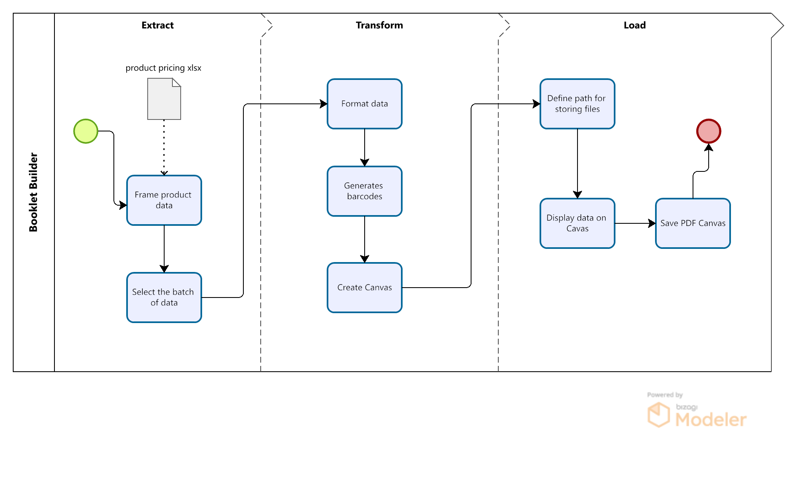
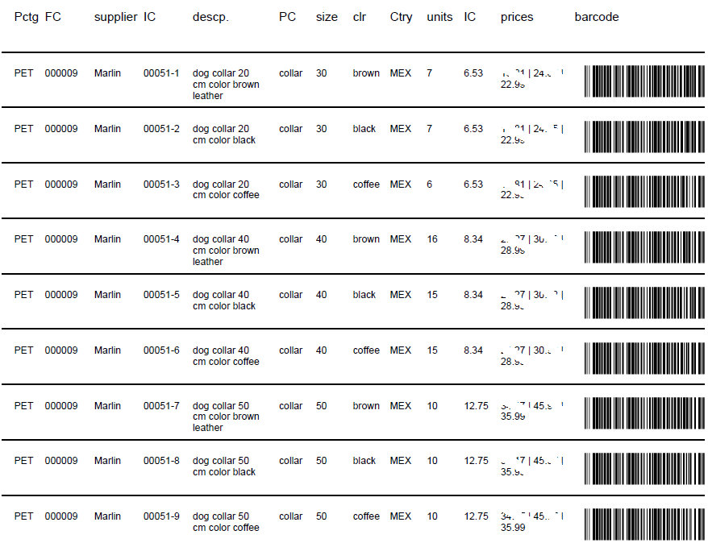

# Billing Generator
[![python][python-badge]][python-link][![jupyter][jupyter-badge]][jupyter-link][![vsc][vsc-badge]][vsc-link]
#### The proyect reads data from files and creates a product booklet in form a table. The product data is stored in xlsx files, the script frames the data and transform it using pandas. Base64 use the attribute of product identity to create jpeg barcode image that will be added to the bookle as part of new attribute. 

#### The following diagram douments the process run by the script to generate the booklet's pages:

## Usage example

#### Example of barcode created using base64 and Code 128 on PUR_00051-1.

#### Example of a page. 

## Development setup

Main libraries in main script:

1. [![pandas][python-pandas-badge]][python-pandas-url], for data transformation
2. [![reportlab][python-reportlab-badge]][python-reportlab-url], for designing the PDF
3. [![barcode][python-barcode-badge]][python-barcode-url], for creating jpeg with barcodes

## Contributing

1.  [![Linkedin][linkedin-badge]][linkedin-url]
2. <a href="https://www.glueckundfund.com/">Glueck und Fund</a>

<!-- Markdown link & img dfn's -->
[python-pandas-badge]: https://img.shields.io/badge/python-pandas-blue
[python-pandas-url]: https://pypi.org/project/pandas/
[python-reportlab-badge]:https://img.shields.io/badge/python-reportlab-green
[python-reportlab-url]: https://pypi.org/project/reportlab/
[python-barcode-badge]: https://img.shields.io/badge/python-barcode-yellow
[python-barcode-url]: https://pypi.org/project/python-barcode/
[linkedin-badge]:https://img.shields.io/badge/LinkedIn-0077B5?style=for-the-badge&logo=linkedin&logoColor=white
[linkedin-url]:https://www.linkedin.com/in/berlangas/
[postgres-badge]:https://img.shields.io/badge/PostgreSQL-316192?style=for-the-badge&logo=postgresql&logoColor=white
[postgres-link]:https://www.postgresql.org/
[python-badge]:https://img.shields.io/badge/Python-FFD43B?style=for-the-badge&logo=python&logoColor=blue
[python-link]:https://www.python.org/
[jupyter-badge]:https://img.shields.io/badge/Jupyter-F37626.svg?&style=for-the-badge&logo=Jupyter&logoColor=white
[jupyter-link]:https://jupyter.org/
[vsc-badge]:https://img.shields.io/badge/VSCode-0078D4?style=for-the-badge&logo=visual%20studio%20code&logoColor=white
[vsc-link]:https://code.visualstudio.com/
